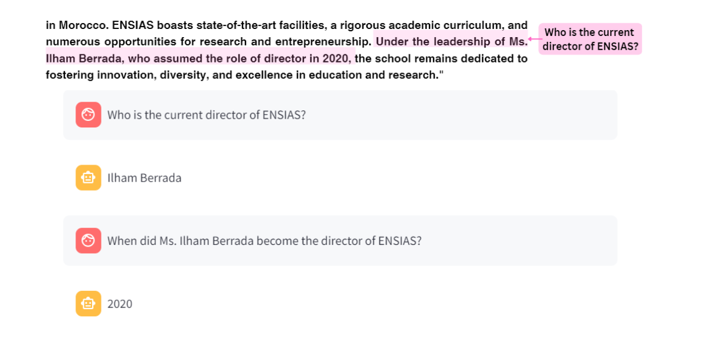

# ENSIAS Chatbot

This application implements a chatbot for answering questions about ENSIAS (National School of Computer Science and Systems Analysis) using Streamlit and the Transformers library by Hugging Face.

The core functionality of the chatbot is built around the Hugging Face question-answering pipeline. This pipeline simplifies the implementation of natural language processing (NLP) tasks by leveraging pre-trained models, allowing for high-quality answers to user questions based on the provided context.


## Features

The chatbot can answer questions on the following topics:

### Information about ENSIAS
- What is ENSIAS?
- When was ENSIAS founded?
- Where is ENSIAS located?
- What programs does ENSIAS offer?


### Study Fields of ENSIAS
- How many study fields are available to engineering students at ENSIAS?
- Can you list the study fields offered at ENSIAS?
- What does BI&A stand for?
- What does GD stand for?
- What does GL stand for?
- What does IDSIT stand for?
- What does IDF stand for?
- What does 2IA stand for?
- What does SSI stand for?
- What does 2SCL stand for?
- What does SSE stand for?


### Admission to ENSIAS
- How competitive is admission to ENSIAS?
- What determines admission to ENSIAS?
  


### Information about the Director
- Who is the current director of ENSIAS?
- When did Ms. Ilham Berrada become the director of ENSIAS?
- What is the role of Ms. Ilham Berrada at ENSIAS?


## Installation

1. Clone this repository:
    ```bash
    git clone https://github.com/yourusername/ensias-chatbot.git
    cd ensias-chatbot
    ```

2. Install the required packages:
    ```bash
    pip install -r requirements.txt
    ```

3. Make sure you have the `transformers` package installed. If not, install it using:
    ```bash
    pip install transformers
    ```

4. Ensure you have Streamlit installed. If not, install it using:
    ```bash
    pip install streamlit
    ```

## Running the Application

1. Navigate to the directory containing the `main.py` file.

2. Run the Streamlit app:
    ```bash
    streamlit run main.py
    ```

3. Open your web browser and go to the URL provided by Streamlit, typically `http://localhost:8501`.

## File Structure

- `main.py`: The main script to run the Streamlit chatbot application.
- `requirements.txt`: List of Python packages required for this project.

## Usage

- Start the Streamlit application by running the command mentioned above.
- The application will display a simple interface where you can ask questions about ENSIAS.
- The chatbot will generate answers based on the provided context.
